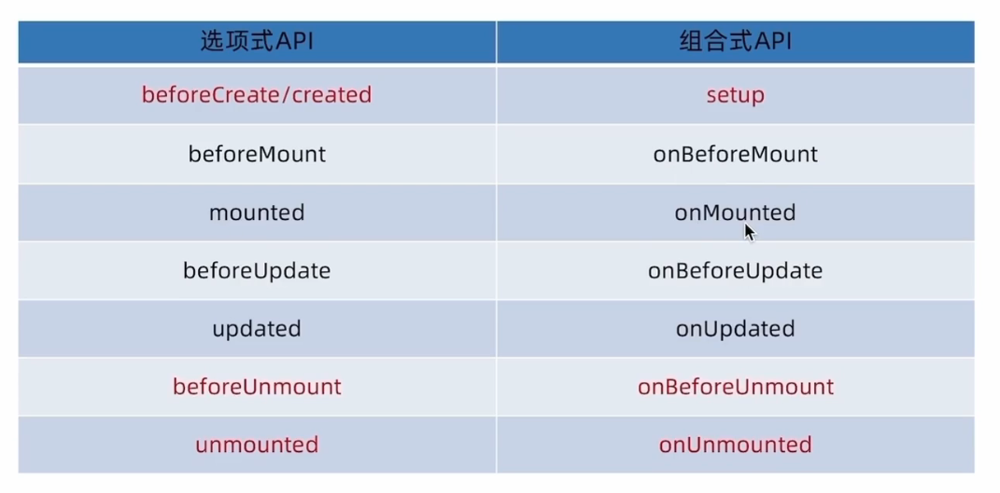

---

---

# vue3入门

## vue3介绍

[vue3官方文档](https://cn.vuejs.org/guide/quick-start.html)

与`vue2`相比，`vue3`的优势：

- 实现同样功能，所需的代码量变少了
- 分散式维护转为集中式维护


## create-vue

`create-vue`是一个基于 Vite 的 Vue 3 项目脚手架工具，由 Vue.js 核心团队成员和社区贡献者开发。它旨在提供更快的开发体验和更现代化的项目结构。`create-vue` 专注于 Vue 3，并且与 Vite 集成，提供了更快速的热重载和构建性能。

### 使用create-vue创建项目

**前提条件**

已经安装16.0或者更高版本的`NodeJs`

**创建一个vue应用**

```shell
npm init vue@latest
```

这一指令会自动安装并执行`create-vue`，让后根据命令行提示输入项目名、各种配置即可


**启动项目**

```shell
#切换到项目目录
cd 项目名
#安装依赖
npm install
#启动项目
npm run dev
```


## vue3项目目录和关键文件


**关键文件**

- `vite.config.js`：项目的配置文件，基于`vite`的配置
- `package.json`：项目包文件，核心依赖项变成了`Vuex3.x`和`vite`
- `main.js`：入口文件，利用`createApp`函数创建应用实例
- `app.vue`：根组件，`script-template-style`，其余`vue2`相比的变化：
  - 脚本`script`和模板`template`顺序调整
  - 模板`template`不再要求唯一根元素
  - 脚本`script`添加`setup`标识支持组合式`API`
- `index.html`：单页入口，提供id为`app`的挂载点


## 组合式API--setup

### setup函数的写法

```vue
export default {
  setup(){
    console.log("setup")
  },
  beforeCreate(){
    console.log("beforeCreate")
  }
}
```

`setup`函数先于`beforeCreate`函数执行


`setup`里面可以定义数据和函数，需要以对象方式用`return`进行返回，但是这样写法就比较复杂，所以`vue3`提供了语法糖的形式

**原始复杂写法**

```vue
<template>
  <div>{{ message }}</div><br/>
  <button @click="logMessage">logMessage</button>
</template>

<script>
export default {
  setup(){
    const message = "this is vue3 message"
    const logMessage = ()=>console.log("logMessage")
    return {
      message,
      logMessage
    }
  }
}
</script>

<style>

</style>
```

**语法糖写法**

```vue
<template>
  <div>{{ message }}</div><br/>
  <button @click="logMessage">logMessage</button>
</template>

<script setup>
  const message = "this is vue3 message"
  const logMessage = ()=>console.log("logMessage")
</script>

<style>

</style>
```

通过`<script setup></script>`语法糖的封装可以更简单的使用组合式API


## 组合式API--reactive和ref函数

### reactive

`reactive`接受对象类型数据的参数传入并返回一个响应式的对象

**核心步骤**

```vue
<script setup>
	//导入
    import { reactive } from 'vue'
    //执行函数 传入对象参数 返回响应对象
    const state = reactive(对象类型数据)
</script>
```

**实例**

```vue
<script setup>
 import { reactive } from 'vue';
 const data = reactive({"count":0})
 const addCount = ()=>data.count+=1
</script>
<template>
  <button @click="addCount">{{ data.count }}</button>
</template>
<style scoped>
</style>
```


### ref

`ref`函数接收简单类型或者对象类型的数据，传入并返回一个响应式的对象

**核心步骤**

```vue
<script setup>
	//导入
    import { ref } from 'vue'
    //执行函数 传入参数 返回响应式数据
    const state = ref(简单类型或者复杂类型数据)
</script>
```

**实例**

```vue
<script setup>
 import { ref } from 'vue';
 const data = ref({"count":0})
 const addCount = ()=>data.value.count+=1
</script>
<template>
  <button @click="addCount">{{ data.count }}</button>
</template>
<style scoped>

</style>
```

**注意：**脚本区域修改`ref`产生的响应式对象数据，必须通过`.value`属性


## computed计算属性函数

`vue3`中的计算属性的基本思想和`vue2`的完全一致，组合式API下的计算属性只是修改了写法

**核心步骤**

```vue
<script setup>
	//1.导入
    import { computed } from 'vue'
    //2.执行函数
    const computedState = computed(()=>{
        return 基于响应式数据做计算之后的值
    })
</script>
```

**实例**

```vue
<script setup>
  import { ref } from 'vue'
  import { computed } from 'vue';
  const list = ref([1,2,3,4,5,6,7,8,9,10])
  const filterList = computed(()=>{
    return list.value.filter((n)=>n%2==0)
  })

  //校验list值发生变化之后,计算属性值是否会相应变化
  setTimeout(()=>list.value.push(10,12),1000)
</script>
<template>
  <div>过滤之前:{{ list }}</div><br/>
  <div>过滤之后:{{ filterList }}</div>
</template>
```


## watch函数

`watch`函数是监听一个或者多个数据的变化，数据变化时执行回调函数

两个额外的参数：

- `immediate`：立即执行
- `deep`：深度监听

### 监听单个数据

```vue
<script setup>
	//导入
	import { watch,ref } from 'vue'
    const count = ref(0)
    //调用watch监听变化
    watch(count,(newValue,oldValue)=>{
        console.log(`count的值发生了变化,原来的值${oldValue},现在的值为${newValue}`)
    })
</script>
```

### 监听多个数据

同时监听多个响应式数据的变化，不管哪个数据变化都需要执行回调

```vue
<script setup>
	import { ref,watch } from 'vue'
    const count = ref(0)
    const name = ref("zs")
    //监听多个数据源
    watch([count,name],([newCount,newName],[oldCount,oldName])=>{
        console.log(`count或者name的值发生了变化,原来的值为:[${oldCount},${oldName}],现在的值为:[${newCount},${newName}]`)
    })
</script>
```

### immediate

在监听器创建时，立即触发回调，响应式数据变化之后继续执行回调

适用场景：比如下来列表，还有选择时，即会触发对应操作，比如向后端发送请求

```vue
<script setup>
  import { ref,watch } from 'vue'
  const count = ref(0)
  const name = ref('zs')
  watch([count,name],([newCount,newName],[oldCount,oldName])=>{
    console.log(`count或者name的值发生了变化,原来的值:[${oldCount},${oldName}],现在的值:[${newCount},${newName}]`)
  },{immediate:true})
</script>
```

### deep

通过`watch`监听的`ref`对象默认都是浅层监听的，直接修改嵌套的对象属性不会触发回调执行，需要开启`deep`选项

```vue
<script setup>
  import { ref,watch } from 'vue'
  const people = ref({
    name:"zs",
    age:27
  })
  watch(people,(newValue,oldValue)=>{
    console.log(`people的值发生了变化,变化之前的值:${oldValue},变化之后的值:${newValue}`)
  },{deep:true})
</script>
```

### 精确监听

开启`deep`之后，对象中任意属性变化，都会触发

如何在不开启`deep`前提下，监听对象的某个属性的变化？

```vue
<script setup>
  import { ref,watch } from 'vue'
  const people = ref({
    name:"zs",
    age:27
  })
  //第一个参数为需要监听的特定属性
  watch(
    ()=>people.value.age,
    (newValue,oldValue)=>console.log(`age的值发生了变化,原来的值为${oldValue},现在的值为:${newValue}`)
  )
</script>
```

## 生命周期函数

### vue3的生命周期API 选项式  vs 组合式



**语法**

- 导入对应的生命周期函数
- 执行生命周期函数  传入对应的回调逻辑

生命周期函数是可以执行多次的，多次执行时传入的回调会在时机成熟时依次执行

```vue
<script setup>
  import { onMounted } from 'vue';
  onMounted(()=>{
    console.log("onMounted1")
  })
  onMounted(()=>{
    console.log("onMounted2")
  })
</script>
```

## 组合式API--父子通信

### 父传子

**基本思想**

1. 父组件中给子组件绑定属性
2. 子组件内部通过`defineProps`接收

父组件`App.vue`

```vue
<script setup>
  import SonPage from './components/SonPage.vue';
  import { ref } from 'vue'
  const count = ref(666)
  setTimeout(()=>{
    count.value+=1
  },1000)
</script>
<template>
  <h2>父组件</h2><br>
 <!-- 父组件给子组件绑定属性 -->
  <SonPage :count="count" message="父组件传来的数据"></SonPage>
</template>
```

子组件`Son.vue`

```vue
<script setup>
  const props = defineProps({
    message:String, //指定数据类型,
    count:Number
  })
  console.log(props)
</script>
<template>
  <div>
    <h2>子组件</h2>
    <p>{{ message }}-- {{ count }}</p>
  </div>
</template>
```

### 子传父

 **基本思想**

1. 父组件给子组件标签通过`@`绑定事件
2. 子组件内部通过`emit`方法触发事件

父组件`App.vue`

```vue
<script setup>
import SonPage from './components/SonPage.vue';
const logMessage = (message)=>{
  console.log(message)
}
</script>
<template>
  <SonPage @send-message="logMessage"></SonPage>
</template>
```

子组件`SonPage.vue`

```vue
<script setup>
//通过defineEmits宏函数生成emit方法
//参数为数组，可以一次性传入当前组件所有自定义的事件
const emit = defineEmits(["send-message"])
//emit方法触发对应的事件
const sendMessage = ()=>{
  emit("send-message","从子组件传来的数据")
}
</script>
<template>
  <button @click="sendMessage">子传父</button>
</template>
```

## 组合式API--模板引用

通过`ref`标识获取真实的`dom`对象或者组件实例对象

**语法**

1. 调用`ref`函数生成一个`ref`对象
2. 通过`ref`表示绑定`ref`对象到标签
3. 在组件挂载完毕之后通过`ref对象.value`获取对应的`dom`对象

```vue
<script setup>
  import { ref,onMounted } from 'vue'
  const divRef = ref(null)
  //组件挂载完毕之后才能获取对应的dom
  onMounted(()=>{
    console.log(divRef.value.innerText)
  })
</script>
<template>
  <div ref="divRef">ref绑定的元素</div>
</template>
```

### 子组件的模板引用

默认情况下在`<script setup>`语法糖下组件内部的属性和方法是


