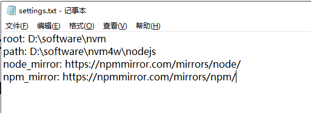
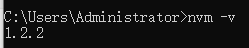

---

---

# nvm

`nvm(Node Version Manager)`，是一个用于管理多个`Node.js`版本的命令行工具。它允许用户在同一台机器上安装和切换不同版本的`Node.js`，非常适合开发者需要在不同的项目中使用不同版本的`Node.js`环境

## 安装

[nvm官网下载地址](https://nvm.uihtm.com/doc/download-nvm.html)

下载`nvm-setup.zip`文件，解压找到`nvm-setup.exe`文件，然后按照正常软件安装流程进行安装即可

**配置NodeJS**

在`nvm`安装目录下，找到`setting.txt`文件，在其中设置`node`和`npm`的国内镜像下载地址

```tex
node_mirror: https://npmmirror.com/mirrors/node/
npm_mirror: https://npmmirror.com/mirrors/npm/
```



**校验是否安装成功**



## 管理NodeJS常用命令

**列出当前已经安装的node版本**

```shell
nvm ls
```

**列出可用的node版本**

```shell
nvm ls available
```

**安装指定的node版本**

```shell
nvm install 版本号
```

**设置使用的node版本**

```shell
nvm use 版本号
```

**查看当前node版本**

```shell
node -v
```

**查看当前npm版本**

```shell
npm -v
```

