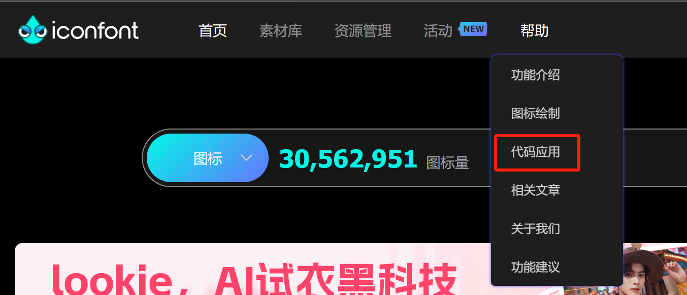
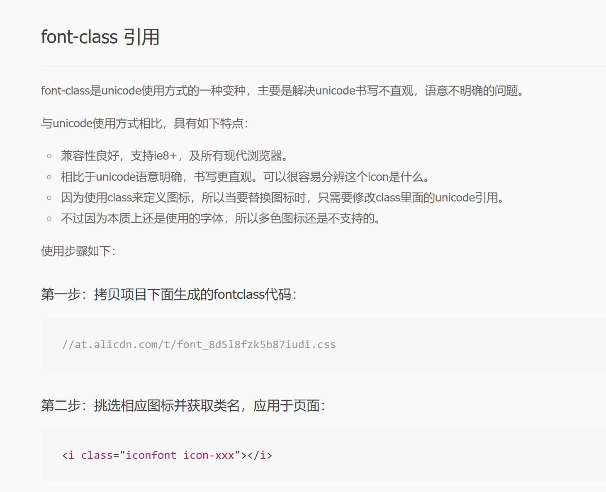
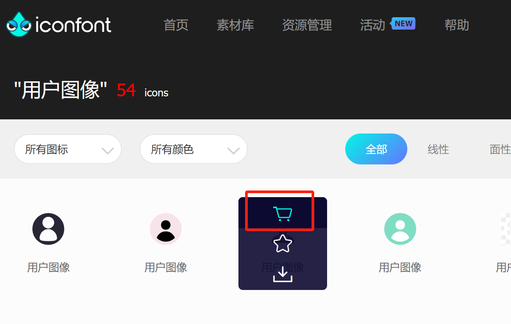
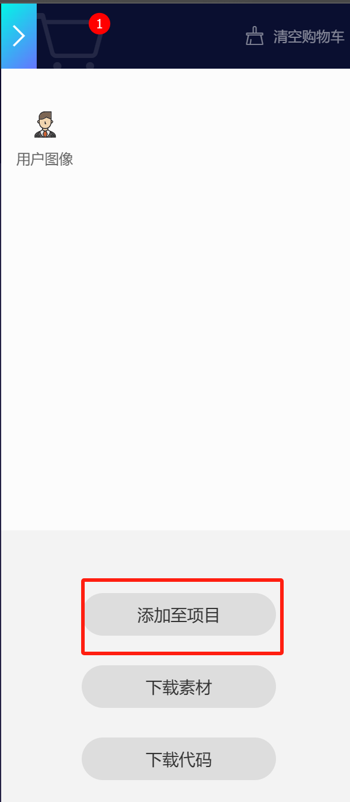
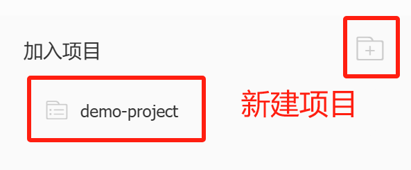
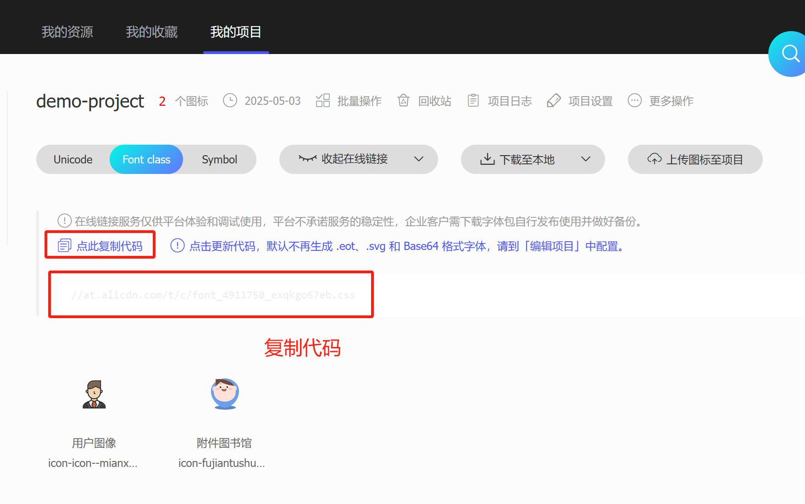
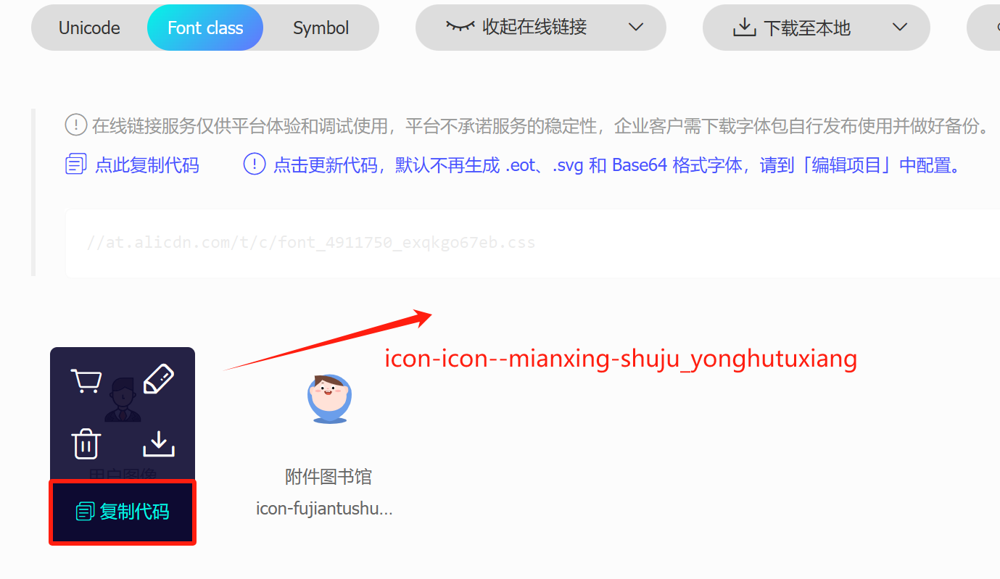
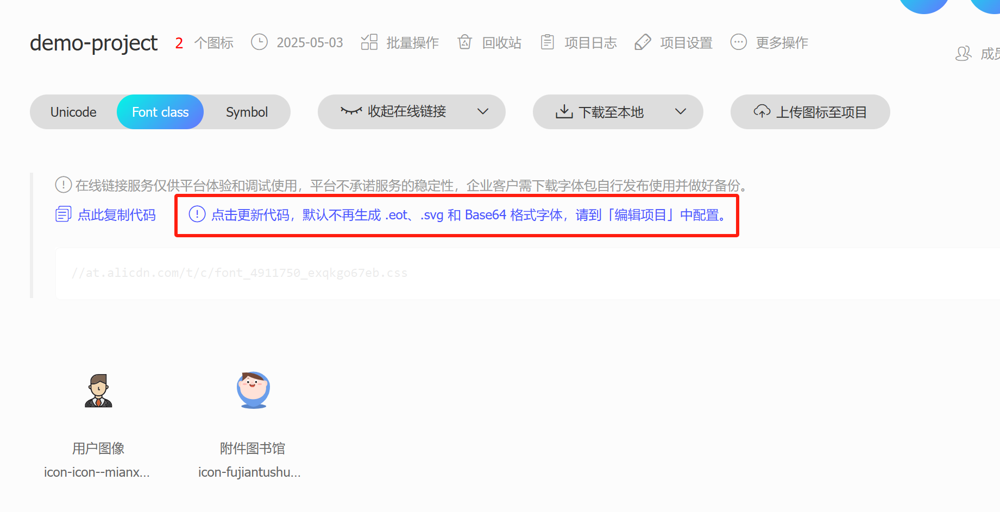
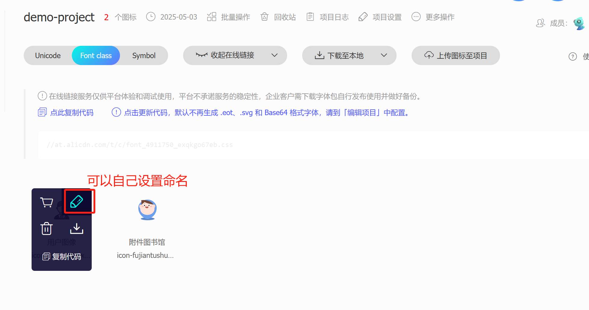
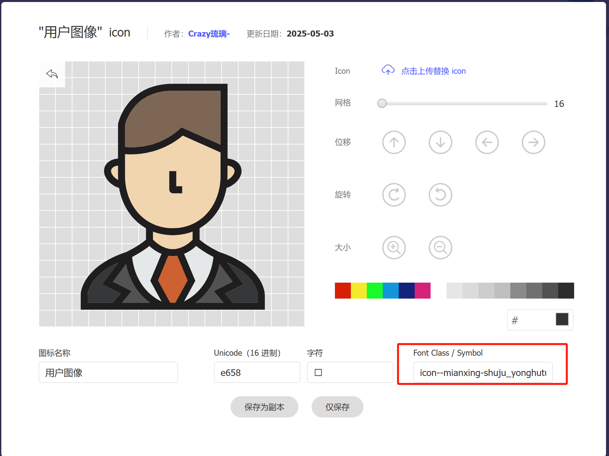

---

---

# 阿里图标引用

[阿里矢量图官网](https://www.iconfont.cn/)


**如何在web项目中应用阿里图标？**





在主页搜索想要的图库，然后将其加入购物车









在项目的`index.html`文件中添加如下代码：

```html
<link rel="stylesheet" href="//at.alicdn.com/t/c/font_4911750_exqkgo67eb.css"/>
<!-- 其中//at.alicdn.com/t/c/font_4911750_exqkgo67eb.css就是上图中复制的代码-->
```

复制想要图标的代码



在想要使用图标的位置添加:

```html
<i class="iconfont icon-xxx"></i>
<!--其中icon-xxx从上图中选择对应图标进行复制代码即可-->
```

每次新加入图标，需要重新更新代码，在`index,html`中引入新的`css`



**对于每个图标，可以自己设置命名**



